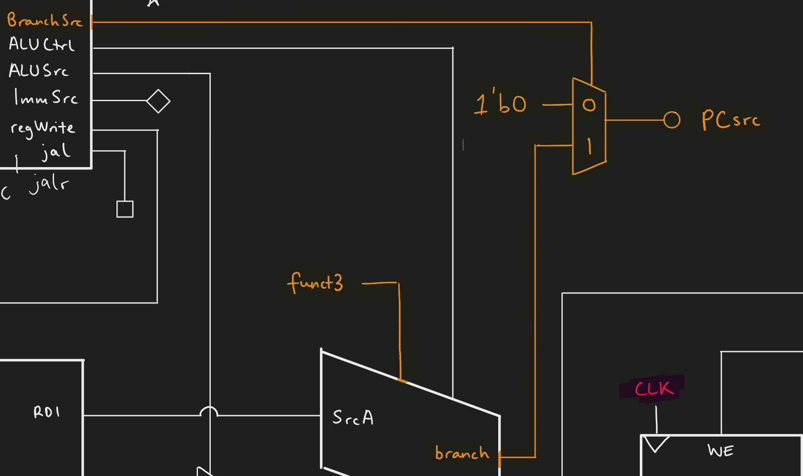

# Nik Lewis' Personal Statement
#### CID: 02031260, Github username: _nlewxxs_

---

##  Summary of Contributions
*  Wrote, tested and debugged control module
* Assisted in debugging Single Cycle design
* Debugged Pipelined design
* Responsible for Git Repo structure
* Wrote shell scripts for easy testing

## Statement
My first contribution was the control module. This work was primarily done in the [control branch](https://github.com/EIE2-IAC-Labs/iac-riscv-cw-14/tree/control), where you can find a detailed outline of the module's functionality and a comprehensive commit history.  I started off by creating a basic skeleton of case statements that could then be easily populated as new instructions were added (see [100cf76](https://github.com/EIE2-IAC-Labs/iac-riscv-cw-14/commit/100cf761eba5fb8710903d14fa05fff4dd23216f)). As new instructions were added, I coordinated with *Ben* to ensure the `ALUctrl` and `ImmSrc` values outputted by the control were as expected by the **ALU** and **extend** modules. I also had to coordinate with *Ana* to ensure that the `memWrite` and `memType` signals were as the **memory** module expected (see [3455653](https://github.com/EIE2-IAC-Labs/iac-riscv-cw-14/commit/3455653560415d9f68d63f684f429360c2fc458b)).

As the project developed and *Ahmed* reported fully passed tests, I would implement new instructions. See commits adding the [Load and Store](https://github.com/EIE2-IAC-Labs/iac-riscv-cw-14/commit/c6feef0aedec930ee0ac442a111c3db54f642350) instructions and later the [JAL and JALR](https://github.com/EIE2-IAC-Labs/iac-riscv-cw-14/commit/37407fc20cdaf41d0df2cac020cd3324178bfbdc) and [Upper Immediate](https://github.com/EIE2-IAC-Labs/iac-riscv-cw-14/commit/fe20803580ce7f5978a2d03a57bc576be85df63f) instructions.

For testing the control module, I created a testbench that would enumerate over all possible (_correct_) `opcode`, `funct3` and `funct7bit5` values, and display the outputs in the terminal (see [bf6f24b](https://github.com/EIE2-IAC-Labs/iac-riscv-cw-14/commit/bf6f24bb6f3de1b7281dc5e029fb576b87d257de)). This made it easy for other people to also test the control module if required, and removed the need for GTKwave since the control module is all asynchronous anyway.  

> Please note that the testbench in the above commit is an intermediate version for the purpose of evidence, for the final version that tests all instructions, please see the control branch. 

As the team member responsible for the control unit, it was important for me to play a part in the debugging as I had a more complete overall understanding of how the different modules interacted. Some of the bugs I identified include: 

* [23b8e19](https://github.com/EIE2-IAC-Labs/iac-riscv-cw-14/commit/23b8e1976a9074833a7d60bf2cd98b9f2d0123c4): `ALUctrl` misbehaving for only _some_ `ADDI` instructions due to `funct7` not being checked and the cases for R-type and I-type instructions being grouped within control. 
* [c88e016](https://github.com/EIE2-IAC-Labs/iac-riscv-cw-14/commit/c88e0162e7579b7ac73fa8e54dbf813ba74996f4): LBU was being performed as LB

And in debugging the pipeline: 

* [4308fe6](https://github.com/EIE2-IAC-Labs/iac-riscv-cw-14/commit/4308fe66a0f1e634c7b97b9f75604ae23f35c73e): **Memory** unit connected to control signals from the incorrect pipeline
* [c1f7ad8](https://github.com/EIE2-IAC-Labs/iac-riscv-cw-14/commit/c1f7ad8b7066b7cc5ab9fd0b341f2d6caa9ecab8): `AUIPC` neglected halfway through pipeline
* [3eb2664](https://github.com/EIE2-IAC-Labs/iac-riscv-cw-14/commit/3eb266476a784a51342d2bc410aee3ef67defe29): `incPC` was being plugged in from the wrong pipeline, **JAL** misbehaving as a result

I was also responsible for setting up the structure of the GitHub repository and making sure everyone was happy with using git. This involved countless calls with teammates to help them fix the repo (to which they can attest),   dealing with merges and making sure that the `playground` was always up to date with the most recent features. Towards the end of the project I started doing this using cherry-picks as it was cleaner than merging, or simply by checking out a file using:
```bash
$ git checkout <branchname> -- <filename>
```
> You can see evidence of conflict fixes and general repo housekeeping in [2bbf5a7](https://github.com/EIE2-IAC-Labs/iac-riscv-cw-14/commit/2bbf5a725cecd6eb0aac0841e7f25205498fc83f), [fe90c19](https://github.com/EIE2-IAC-Labs/iac-riscv-cw-14/commit/fe90c1999ff437ba2c32a5c164a79986bf6540e7), and [17a6a26](https://github.com/EIE2-IAC-Labs/iac-riscv-cw-14/commit/17a6a26246a59403edc62aca53f9f8f696b80a08) as well as many others. 

Towards the end of the project, I created two bash scripts`pdf.sh` and `f1.sh` that modify the testbench `cpu_tb.cpp` and instructions `rom.sv` to run the respective program (see [182461f](https://github.com/EIE2-IAC-Labs/iac-riscv-cw-14/commit/182461f537c4d719b4795cdc34b1b049879c3a62)). 

For this I made use of the `sed` bash command, for instance:
```bash
$ sed -i 's/2000/1000000/' cpu_tb.cpp
```
would change the number of clock cycles from 2000 to 1000000. There are other uses of this which comment/uncomment certain parts of the code but they are extremely visually confusing due to escape sequences required for `*` and `/` characters, please see the files. This makes it easy to run either program. 

---

## What I learned 

### Git
Learned about creating branches, pushing and pulling from terminal, using personal access tokens, merging and rebasing, cherry-picking, squashing commits, stashing, and most importantly - resetting `HEAD` to previous commits and force-overriding the remote in case of accidental pushes.

### Markdown
Learned how to use markdown to write README files.

### System Verilog and Verilator
Much more comfortable writing `.sv` files and verilating them. I am now familiar with most of the common errors verilator throws. 

### Debugging skills
I feel more competent debugging using GTKwave.

### Group dynamics
I learned that it is important to give each team member room to be creative and make their own decisions about how to implement their respective features. 

Everyone works at their own pace and it's important to give them enough time to do so. 

---

## Mistakes

* Although it only really happened once, there was a miscommunication between **ALU** and **Control** that resulted in the `jalr` and `jal` control signals not matching up. This was a difficulty when debugging because from the perspective of each individual module they were working correctly. I believe this was largely my fault for not including a whole table of inputs/outputs in the control README. 

* Some control signals were treated as "don't care" in cases when they actually are not. In earlier [control](https://github.com/EIE2-IAC-Labs/iac-riscv-cw-14/tree/control) commits, the `ALUctrl` was not accounted for in branch cases. This would only cause problems in some particular cases, so was not immediately obvious. It was fixed in [239f416](https://github.com/EIE2-IAC-Labs/iac-riscv-cw-14/commit/239f416608988a948125b2ca81511129e7186454).

--- 

## Design Decisions
* Decided to assign 4 bits to `ALUctrl` and 3 to `ImmSrc`
> This was less of a creative decision and more of a necessity
* Decided to both decode and execute the branches in the **ALU**. Since the register values are required to determine if we branch or not, branch comparisons would have to be done in the **ALU / Execute stage**. So if the control unit were to decode the branch instructions then it would still have to send a 3-bit control signal to the **ALU**. This is clearly redundant and it made more sense to us to pass `funct3` directly into the **ALU** and have a `branch` output flag coming out of here. 
The **Control Unit** would output a `BranchSrc` signal that would give control of `PCsrc` to the **ALU**, see below:



> TLDR: Removed `Zero` input to control, dealt with branches in ALU.

* Decided with _Ana_ to split `addrCtrl` into two separate memory control signals, `memType` (specifies byte, half or word) and `memSign` (specifies signed/unsigned). Implementation can be seen in [3455653](https://github.com/EIE2-IAC-Labs/iac-riscv-cw-14/commit/3455653560415d9f68d63f684f429360c2fc458b). 


| Instruction | &nbsp; &nbsp; &nbsp; &nbsp; &nbsp; &nbsp; &nbsp; &nbsp; `memType` &nbsp; &nbsp; &nbsp; &nbsp; &nbsp; &nbsp; &nbsp; &nbsp; | &nbsp; &nbsp; &nbsp; &nbsp; &nbsp; &nbsp; &nbsp; &nbsp; `memSign` &nbsp; &nbsp; &nbsp; &nbsp; &nbsp; &nbsp; &nbsp; &nbsp;|
|:--------------:|:--------------:|:--------:|            
| LB | 01 | 0
| LH | 10 | 0
| LW | 00 | 0
| LBU | 01 | 1
| LHU | 10 | 1
| SB | 01 | 0
| SH | 10 | 0
| SW | 00 | 0

* Created separate control outputs for `auipc`, `jal` and `jalr` instructions, to directly drive multiplexers that override the relevant wires. 

---

## Next time
Things that I would do differently next time include:

* In each branch, I would consider having a full previous version of the CPU. For instance, the ALU branch would also have the main test-bench and copies of the ram, control, etc
> This makes merging easier as it prevents the error: "README.md was deleted in HEAD", which was the main reason I resorted to cherry-picking. 

* Use pull requests instead of merges, as it is cleaner and more common practice in industry.

* Do not test your own code extensively, but have someone else write their own test plan and execute them on your program. 

> I think this could have helped spot 80% of the errors we encountered.  I know this was in the project brief and I now understand why. 
